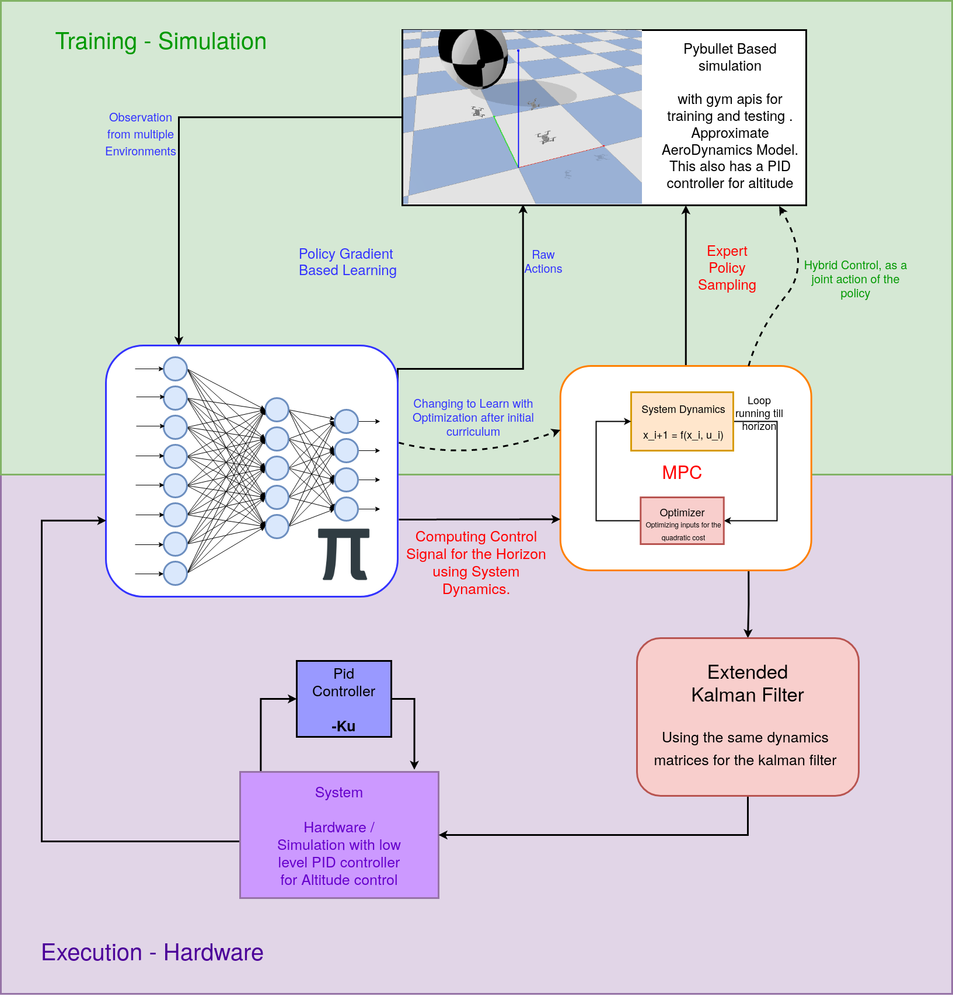
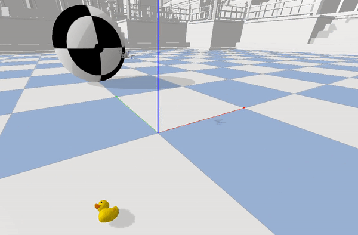
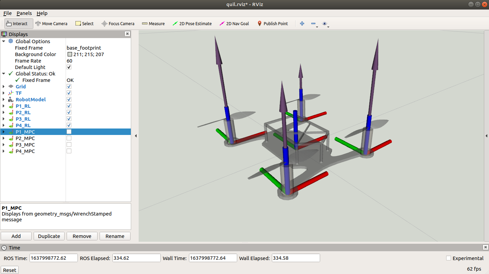

## Modding the hardware platform

With a simple a simple RC drone with modified [BetaFlight](https://github.com/betaflight/betaflight) Firmware to allow mavlink communication and a external companion PC such as Banana pi zero m2 we plan to deploy swarm of these drones in to real world problems. 

Our Major targets were, 
1. Visual odometry
2. Optimal Controller for tracing trajectory
3. Trajectory optimization for multi agent systems.

We have been able to answer 2 of the above.

### Visual odometry

We have been able to modify the [Viso2ROS](http://wiki.ros.org/viso2_ros) to run with a less number of feature points and with reduced map foot print for easier localization with help of few apriltags, for global coordinates and not using the whole map.
We also to utilize the MALI GPU of the onboard computer compiled opencv with OpenCL to get a slightly better performance in the framerate of the localization. There is not much more novelty introduced from our end.

### Optimal controller - RL Aided MPC

With limited computation, running an onboard MPC with non-linear Dynamics will fail to provide responsive control. Another Famous approach is RL-based controllers, where the feedback is a learned approximation of an expert demonstration from something like an MPC. But these policies are many layers deep and make it difficult to run in constrained hardware. Shallower policies tend to approximate the dynamics a lot and learn a sub-optimal policy that fails to work in many scenarios that are not desirable in multi-agent systems. 

Hence I propose use of a small RL policies output as the hot solution to the MPC. Conceptually its a very simple task but this requires a responsive pipeline for being able to execute at a desired Rate. Below is our pipeline in Simulation and in Hardware.
 

I have used the [gym-pybullet-drones](https://github.com/utiasDSL/gym-pybullet-drones), as the base environment for our drone. We have imported our designs into the environment, Along with parameters for the drone like Air Drag coefficients. 

For the MPC I have used the mpc.pytorch library from locuslab. As this uses pytorch backend for computation and optimization. This increased the efficiency and drastically decreased train time from 2 hrs to 45 mins.

For the training I implemented a simple 3 layer deep policy implemented using Pytorch and I used simple Policy Gradient algorithm, I trained using Ray Library with multiple workers while extending the dimension of the control of the MPC for optimizing the Training Loop.

We have tried using both the linear and the non-linear dynamics of the MPC, we resorted on using the linear dynamics along with RL for better deployment keeping the hardware limitation in mind

#### Reward
We have used a simple curriculum of running the RL based estimations of the optimal force values for each properllers. 
As a low level PID controller is running for maintaining the altitude altitude, our main goal was to learn the force value estimation directly from a expert policy like the mpc, and later we could work on how the RL algorithm would optimize hot solutions than estimating better optimal control inputs. This is a key difference as here it would not have to model higher non-linearity of the horizon while optimizing the hot solution to the MPC.

Later in the curriculum we add and extra term for decreasing the number of iterations taken to converge by an MPC. This reward is given from the MPC node and is just taken along side the state reward given from the environment.

Hence our net Reward is as follows

#### Results
After training for 8000 episodes we reach a decent point with high enough reward and good amount of speculation to use our Policy with current Architecture. Below is the demonstration of the robot trying to trace a figure 8 using the current Control architecture.

<i>tracing the figure 8 while running at 70 Hz</i>

As it can be seen this is able to trace the given trajectory. Below is the example of the Optimization the MPC provides over the RL Estimations 

<i>Policy Estimations for significant angles of Rolls and Pitches</i>

<i>MPC based optimization reducing the Unsafe values of the Thrusts for smoother long horizon performance</i>

A more analytic study shows the improvement in performance by the need of steps to converge the optimization and the rate of diverge or failure in optimizing the policy within the limit.

  

For feasible run time of the MPC we use a threshold of optimal 5 iterations and maximum of 10 iterations would allow use to run the Pipeline on our desired system. Here we are optimizing the trajectories within a certain amount of cost which are experimented for suiting both performance and efficiency.

As can be seen from the curve performance of Pipeline increases continuing to train it further hence a proportional correlation confirms the proof of concept.

The second metrics we are using the rate of failures in either not being able to find a solution or not converging before the 10 iterations threshold, as we have used the approximated linear dynamics of the Drone we are entitled to diverge in prediction of the future states and hence give an sub optimal response, We see this is also improved with the current architecture and is able to robustly work in a bigger configuration space. 

Given the improvement of the performance against only MPC based control makes it a very good fit for our application. Currently hardware code structured would have to finalized as we would have to make utilize most of all the onboard computation for both the RL policy forward propagation and the MPC optimization. Hence we are working on modifing [Mav_Control_RW](https://github.com/ethz-asl/mav_control_rw) for our needs to use a betaflight firmware as the lowlevel controller and communicated through MavLink.

## Future works
We are currently working on implementing the hardware pipline for feasible hardware results. And constantly estimating optimal parameters to run the pipe line with.

As Specified in the start of the post we are also trying to solve the problem of trajectory optimization of Multi-Agent systems for which we would be more than happy to collaborate or hear from you.