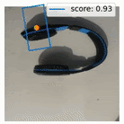
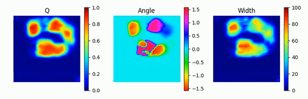
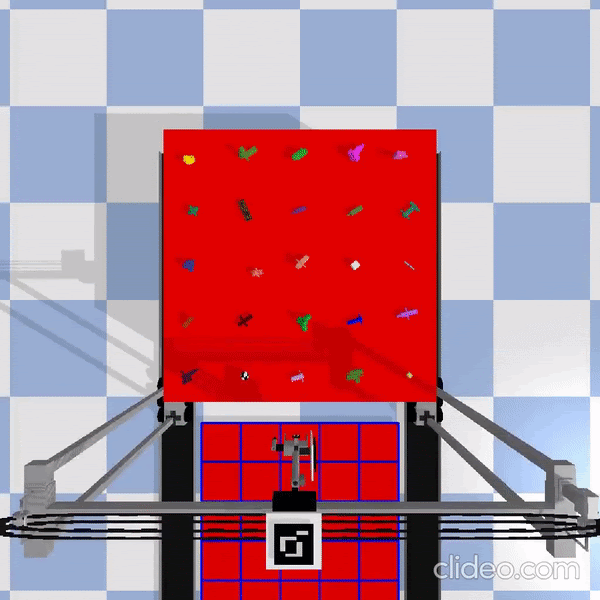
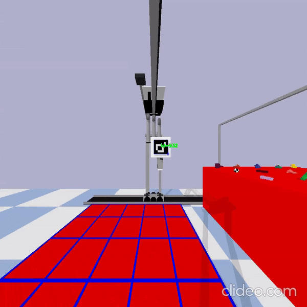
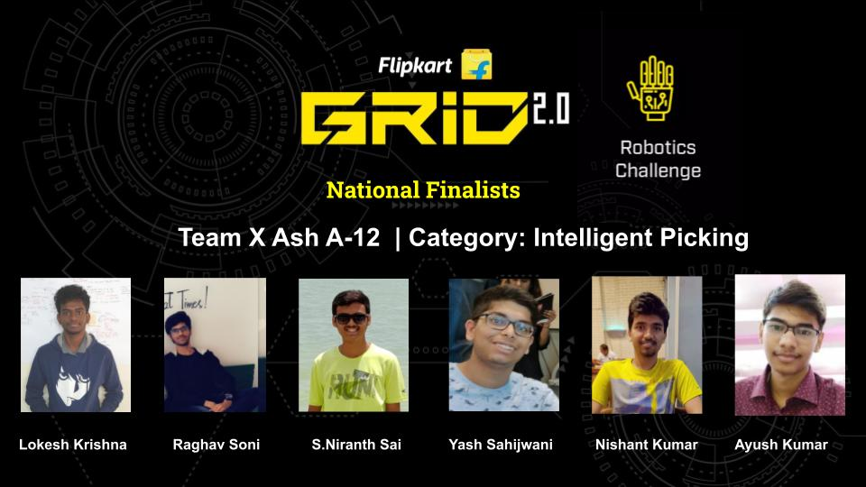
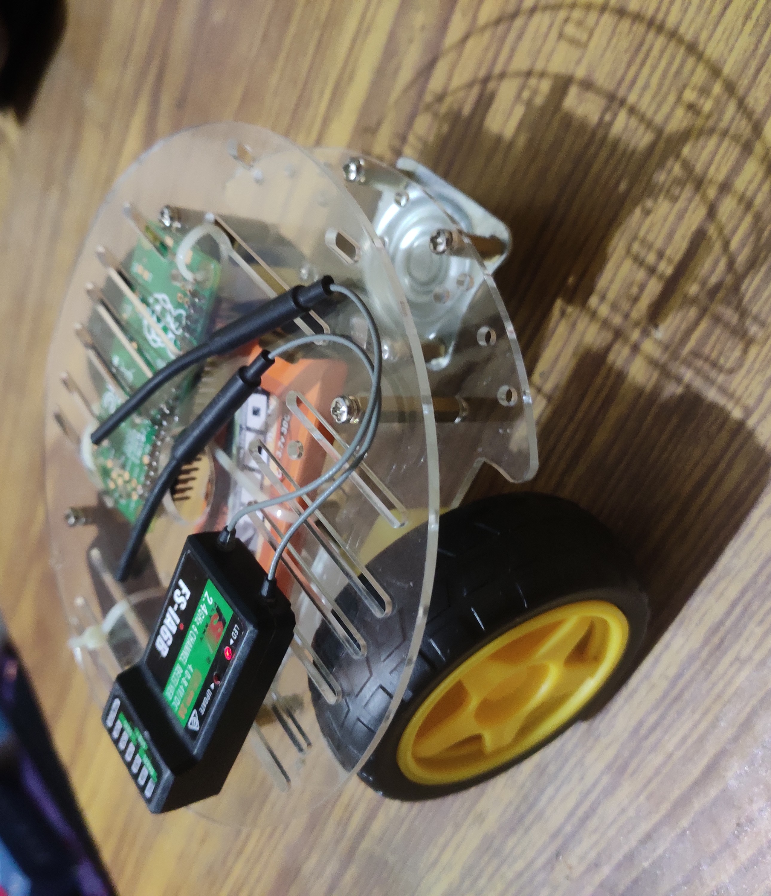
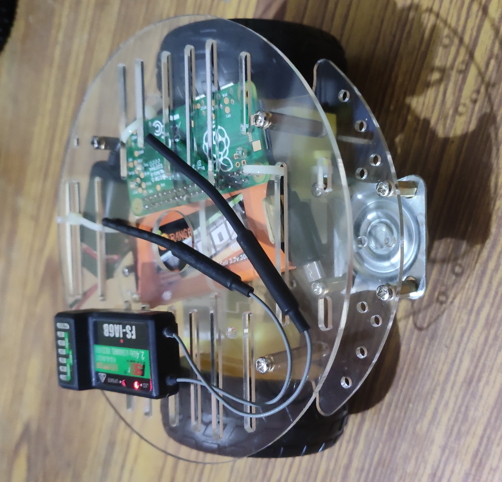
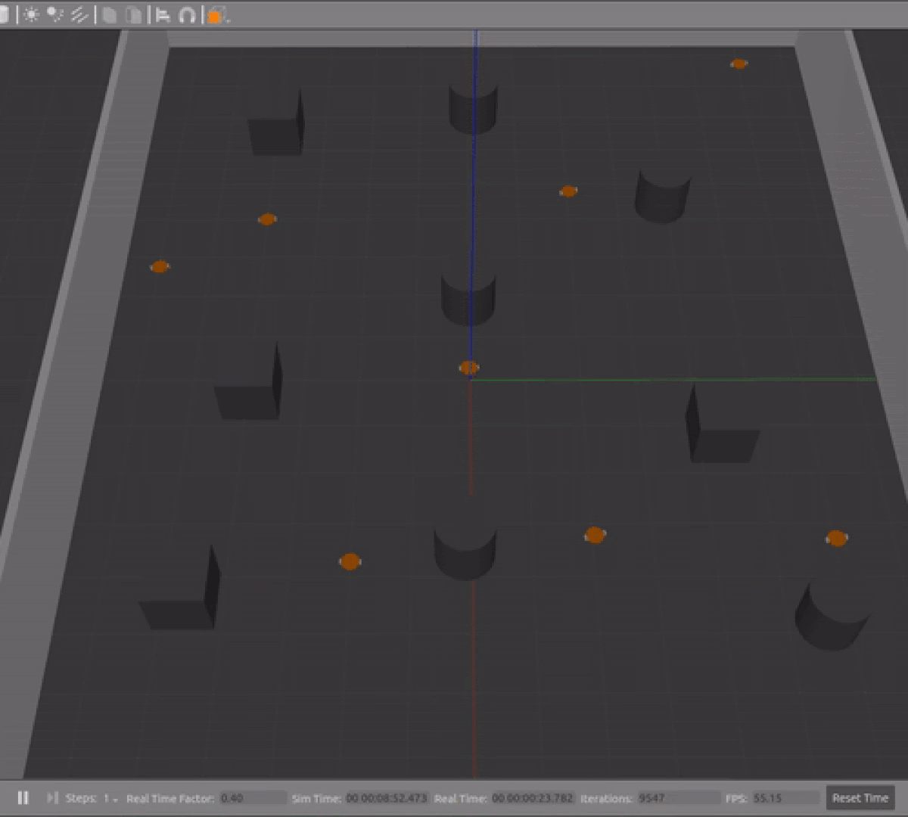

Flipkart Grid is a national robotics challenge that is organised by Flipkart annually. It is a distinguished event in which **2000+ teams** representing different institutes participate from **across the nation**.

Grid 3.0 is being organised by Flipkart this year and the problem statement requires a swarm of hardware bots to be built. Here is the link to this year’s problem statement-

<a href="https://dare2compete.com/api/competition/get-attachment/60e573fc7e126_Grid_3.0_Problem_Statement.pdf">Flipkart Grid 3.0 - Robotics Challenge : Problem Statement</a>

(Building a swarm of bots with active communication for autonomous package sortation with a central monitoring system in an industrial environment.)

Our team named **“NoSignal”** comprising 15 students with expertise across different fields has registered for the event and we are looking forward to ace the competition this year and bring laurels to our institute. 

**We just need your support to do it well!!**

<!-- <form> </form> -->

	

		
<b>Recieved Rs.51,200 out of Rs.73000</b> 

	

Help us reach there!!.

<button name="button"> <a href="#payment-options">Support Us</a></button>

## Our Voyage so far-
We started by forming a team in 2020 to take part in Grid 2.0. It consisted of **3 novice juniors and 3 experienced seniors**. The team worked hard and learned a lot of things through the event. The journey included sleepless nights, long brainstorming sessions and a lot of innovation and hard work.

We designed a novel hardware and implemented software algorithms to predict the positions and orientations of the gripper to grab various objects. **Here are some results** from our endeavor -

<b> Predicting grabbing points for a headphone</b>

|  |  |
|--|--|
| a | b |

<b>Hardware at work in simulation</b> 

**The team**, representing our prestigious institute, **took part in Grid 2.0 last year** and were able to make it to **the national finals in our very first attempt** at such a competition, among the top 3 teams  from all over the nation. From then, it has only motivated us to proceed further and prepare ourselves for the next iteration of Flipkart.. Throughout the  year, **we have trained our team on various skill sets required for the real world deployment of robotics** through various competitions and events. This has made our current team members better mentors and our incoming new members better roboticists. Thus we are now ready to embark upon the next big challenge with a bigger and a better team.

## Current Progress and Plan

We are planning to solve the problem statement using very modest hardware and our innovative solutions. In this harsh time we are facing great difficulty in fabricating the robots due to lack of funds and collaboration space. For now we were able to solve a genuine amount of the problem statement while having built one prototype that is **autonomously controlled by ROS**.

|||
|--|--|
| a| b|  

 
<i>Our First Prototype</i> 

This is a modest hardware consisting of BO motors with encoders, Raspberry pi zero W (For Onboard computation), and a off shell Chassis with caster wheels. We are continuously testing out Mechanisms for Package Dropping.

*Swarm of robots moving around a Warehouse*
</img>

Even Before testing out our algorithms we test them on **Gazebo** (DARPA accepted simulator), And iterate to make better algorithms. We see this technology to scale up in any Industry as we are using **State of the Art** algorithms for Controlling and Trajectory Planning.

## Expenses

Given below is the estimate for building **8 robots** with tools at our disposal.

|**Name**|**Quantity**|**Cost**|**Link**|
|--|--|--|--|
| 2WD chassis| 8| 499*8 = 3992|[Buy 2WD Aluminum Smart Robot Car Chassis Kit Red Online](https://robu.in/product/red-2wd-aluminum-smart-robot-car-chassis-kit-diy/)|
|N20 motors| 32| 469*24 = 11256|[150:1 Micro Metal Gearmotor HP 6V](https://robu.in/product/n20-6v-100rpm-micro-metal-gear-motor-with-encoder/?gclid=Cj0KCQjw_8mHBhClARIsABfFgphNos2eE8Vs5mcJfAy-3r_hHlnJ4MKGB80tvpEyOUE1s0eVacfclJYaAsUKEALw_wcB)|
|1300 3S Lipo| 8| 1000*8 = 8000|--offline--|
|LN298| 8| 125*16 = 2000|[Buy L298N 2A Motor Driver Module Online at the Best Price](https://robu.in/product/l298-based-motor-driver-module-2a/) |
|Mini Buck| 8| 60*8 = 480| --offline--|
|Raspberry pi zero w+ microsd card| 8| 1800*8 = 14400|[Buy Raspberry Pi Zero W (Wireless) With In-Built Wifi and Bluetooth](https://robu.in/product/raspberry-pi-zero-w/) |
|Omni Wheels 38dia | 24| 24*460 = 11040| --offline--|
|IMU 9 axis| 8| 415*8 = 3320| [Buy 9DOF 3Axis Gyro Accelero and Magnetometer Sensor Module In India](https://robu.in/product/mpu9250-9-axis-attitude-gyro-accelerator-magnetometer-sensor-module/)|
|Cameras| 4| 1900*4 = 7600|[HP w200 HD 720p/30 Fps Webcam, Built-in Mic, Plug and Play, Wide-Angle View for Video Calling, Skype, Zoom, Microsoft Teams](https://www.amazon.in/HP-Webcam-Wide-Angle-Calling-Microsoft/dp/B08FTH8G8B/ref=sr_1_6?crid=126STUMKWCW33&dchild=1&keywords=webcam&qid=1625427683&s=electronics&sprefix=we%2Celectronics%2C459&sr=1-6) |
|Acrylic sheets | 2| 999* 3 = 2997| [Acrylic Sheet 3MM Clear (16x24inch)](https://www.amazon.in/Acrylic-Sheet-3MM-Clear-16x24inch/dp/B08K48SQW8/ref=asc_df_B08K48SQW8/?tag=googleshopdes-21&linkCode=df0&hvadid=397082163833&hvpos=&hvnetw=g&hvrand=13054231399609441511&hvpone=&hvptwo=&hvqmt=&hvdev=c&hvdvcmdl=&hvlocint=&hvlocphy=1007768&hvtargid=pla-1105382281902&psc=1&ext_vrnc=hi)|
| Servo motors| 16| 250* 16 = 4000| [Tower Pro MG996R Digital Metal Gear High Torque Servo Motor (180 Degree Rotation)](https://www.electronicscomp.com/mg996r-metal-gear-servo-motor)|
|--|--|--|--|
| | Total| 69085| |
| | Overhead Expn.| 3915| |
| | **TOTAL**:| 73000| |

Do consider consider contributing :)

## Payment Options

 

With the generous support of our donors we have reached such a huge milestone. 

	

		
<b>Recieved Rs.51,200 out of Rs.73000</b> 

	

Help us reach there!!.

<!-- <form> </form> -->
For now we are taking payments only through <b>UPI</b>, for paying use the qr code or UPI id

  

Upi ID : <input type="text" value="9149222275@upi" id="myUpi" readonly/>
<button onclick="myFunction2()" onmouseout="outFunc2()" style="border-radius: 8px; height: 50px; text-align: center; display: inline-block;margin: 100px 0px 0px 20px">

</img> 
</button>

<!--  -->

If you are facing any technical difficulty you can pay the below number through <b>UPI</b>, or you may choose to contact through Phone or Whatsapp.

Phone Number : <input type="text" value="+919897367156" id="myInput" readonly/> 

<button onclick="myFunction()" onmouseout="outFunc()">
  Copy to clipboard

  </button>

