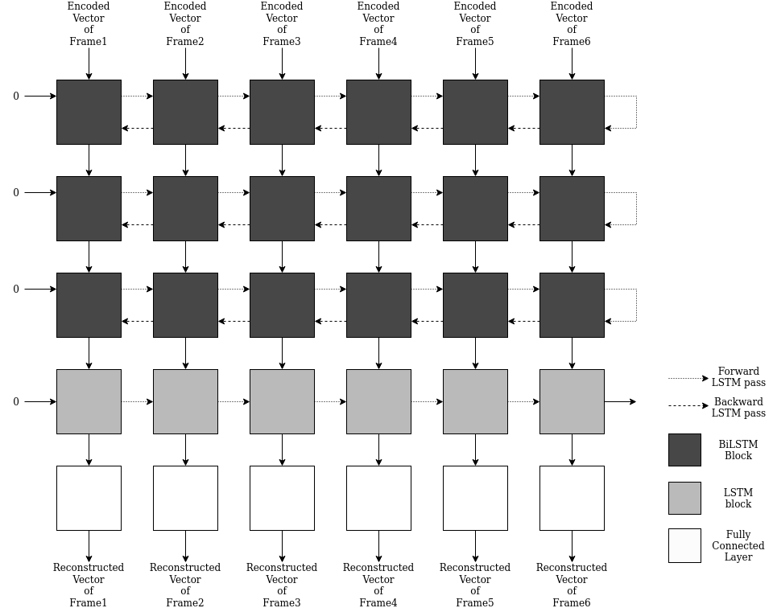

# Gait-Occlusion-GAN

*UnPublished: made public temporally*

Original code for the paper **"BGaitR-Net: Occluded Gait Sequence reconstruction with temporally constrained model for gait recognition"** under Prof. Pratik Chattopadhyay.

This work proposes simple BiDirectional Filtering of the latent vectors of The silhouettes. TimeSeries Data of the latent space is been filter for reconstruction using a simple Bi-LSTM trained with A sophisticated method proposed in the paper.
The Conversion of the Spatio Data to latent space was done using a  conditional Variational AutoEncoder.
We have used a 3 Datasets : for training 2 namely, CASIA-B, OU-ISIR large population, and testing 1 namely, TumIITKGP.

*A conditional GAN based approach is also been presented in code*

## Proposed approach

We have used a Model based approach for feature extraction using **Temporally constrained Kmeans Clustering** and **Short Path in a Weighted Graph** for assigning Keypose for the Sequence even in case of Occlusion. This achieved substantially better results

Propoesed Approach

  Model Architecture

  Model Architecture - 2

## Results

Visual inspection of Reconstruction for a sequence with over 73 occlusion. 
(a) Input Sequence 
(b) Reconstructed Sequence 
(c) Ground Truth 
  
Successfully able to Reconstruct 22 Frames from just 8 Frames with a Dice score 0.98

  CMC Accuracy of Gait Recognition for TUM-IITKGP Dataset

